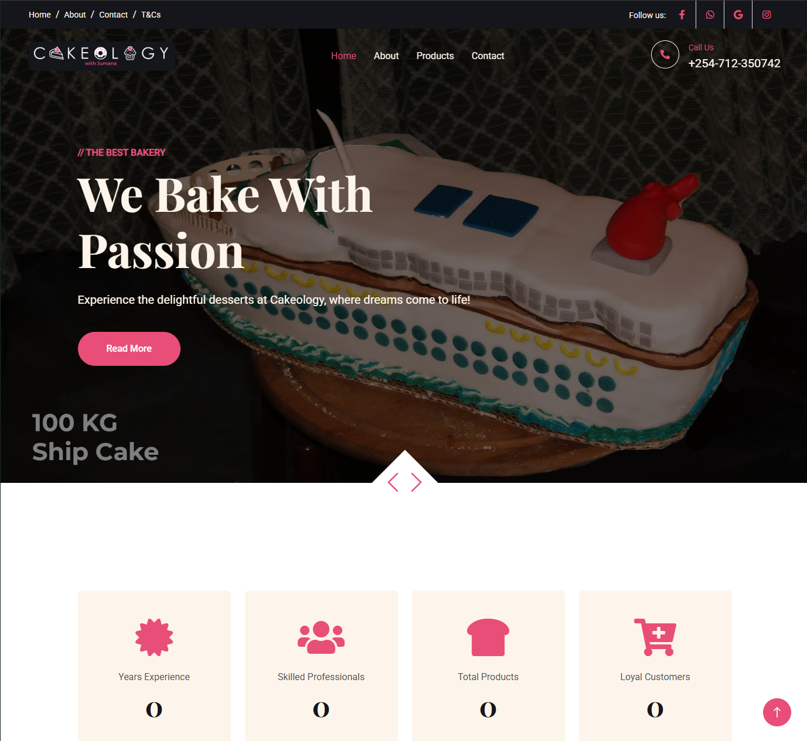
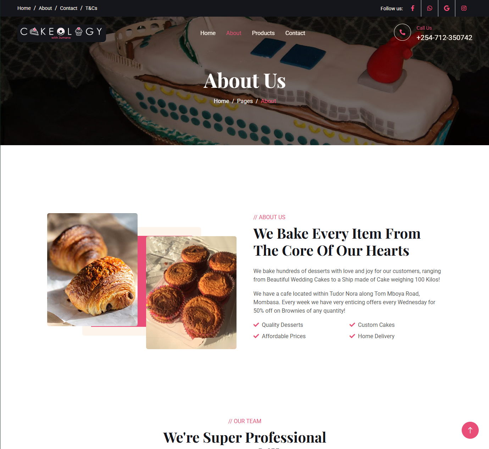
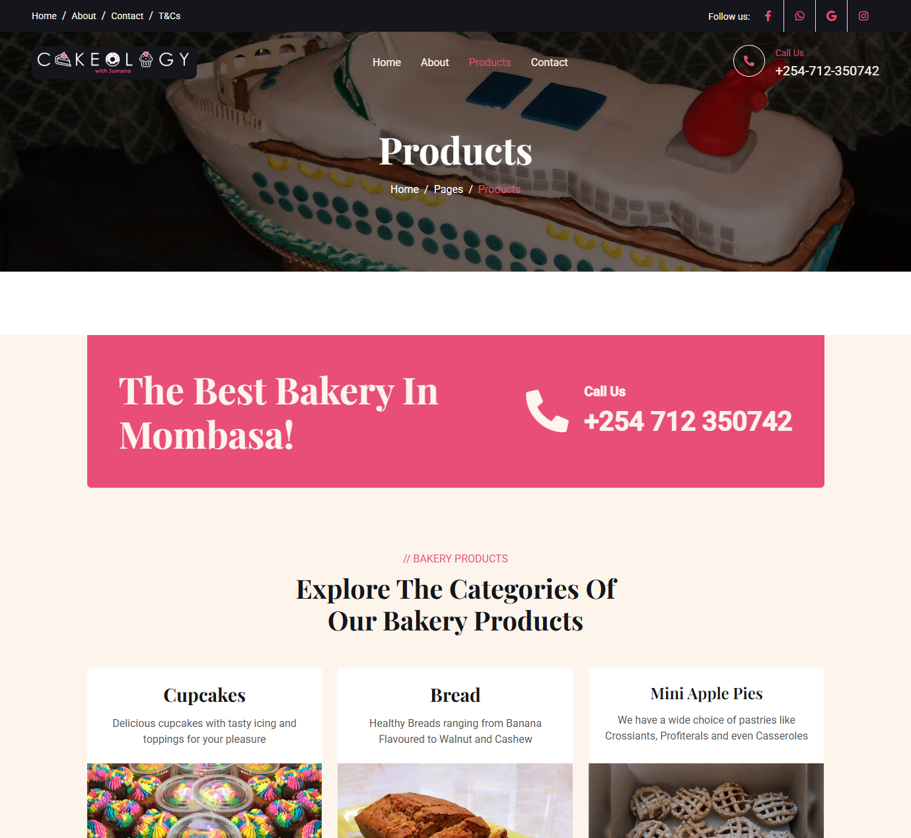

# Cakeology Mombasa

Cakeology is a responsive bakery website for Cakeology With Jumana in Mombasa. It presents the bakery, products, contact details, and social links in a simple static website that is easy to host.

## Demo and screenshots

Live site: [cakeologyke.com](https://cakeologyke.com)







## Features

- Responsive home, about, products, contact, team, and terms pages
- Product and bakery information with clear navigation
- Image carousel and testimonial carousel
- Mobile navigation and responsive Bootstrap layout
- Animated page elements, counters, and back-to-top control
- Contact and social media links for customers
- Static hosting support with a custom domain

## Technologies

- HTML5
- CSS3 and SCSS
- JavaScript with jQuery
- Bootstrap
- Owl Carousel
- WOW.js, Animate.css, Waypoints, and CounterUp

## Getting started

This is a static website, so it does not need Python, `pip`, or a package installation step.

```bash
git clone <repository-url>
cd cakeologyke
python -m http.server 8000
```

Open [http://localhost:8000](http://localhost:8000) in a browser. You can also open `index.html` directly, but a local server is better because it matches how the site is hosted.

## Usage

Open the home page and use the navigation to browse the bakery information and products. Use the carousel controls to view featured content, and use the contact or social links to reach the bakery.

## Project structure

```text
index.html       Home page
about.html       About page
product.html     Products page
contact.html     Contact page
team.html        Team page
terms.html       Terms and conditions
css/             Compiled stylesheets
scss/            Bootstrap and project SCSS source
js/              Site JavaScript
lib/             Third-party front-end libraries
img/             Website images and branding
screenshots/     README screenshots
CNAME            Custom domain configuration
```

## Design and technical decisions

The project uses plain HTML, SCSS, and JavaScript so it can load quickly and be deployed without a backend or build server. Bootstrap provides the responsive grid and common components, while Owl Carousel handles rotating content. Keeping the pages as separate HTML files makes the main customer journeys easy to understand and maintain.

## Challenges and lessons learned

- Keeping image, stylesheet, and script paths correct across several separate HTML pages
- Making the navigation, carousels, and content remain usable on small screens
- Coordinating several third-party libraries in the correct loading order
- Preventing layout changes when carousel images and animated sections load
- Deploying a static site and connecting it to a custom domain through DNS

The project reinforced the importance of testing pages at different screen sizes, checking browser console errors, and using a local server before deployment.

## Limitations and future improvements

- The site does not currently include online ordering or payment processing
- Product content is maintained directly in HTML rather than through a CMS
- There is no automated test suite or build pipeline yet
- Form handling and customer enquiries could be connected to a backend service
- Images could be compressed and served in modern formats for faster loading

## Testing

Testing is currently manual. Run the local server, open each page, and check the navigation, carousels, contact links, images, and responsive layout in a desktop and mobile-sized browser window.

```bash
python -m http.server 8000
```

## License

No license has been specified for this project yet. Add a license before redistributing the code or assets.

## Contact

- Website: [cakeologyke.com](https://cakeologyke.com)
- Maintainer: NaeemChakera
